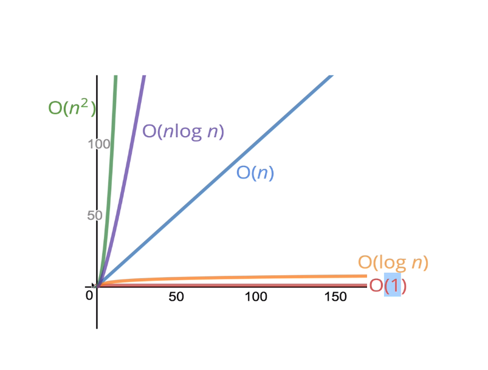

# Big O

- What is big O?

  > a way of talking about the performance of our algorithms as the input moves toward infinity

- Big O considers the worst case scenario
- High level understanding of time and space complexity
- We aren't concerned with precision only about general trends
- There are many common run-times
  
- There are many others but the important thing to remember is they are boiled down based on elementary operations
- O(1) is great, but also O(log n) is very good
- O(n log n) is better then 0(n^2)
- Its important to keep the logarithm complexity in mind
  - certain searching algorithms have log time complexity
  - many efficient sorting algorithms involve logarithmic complexity
  - Recursion sometimes involves logarithmic space complexity
