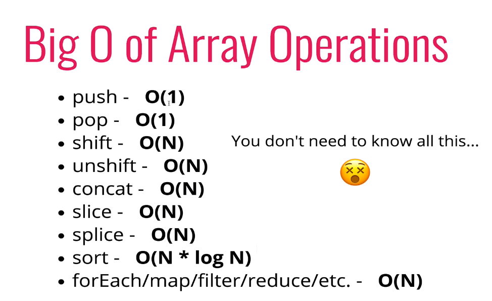

# Deep Dive into objects and arrays via Big 0

- adding elements to the beginning of an array is costly
- compare and contrast run times for built-in methods

## Objects

- Unordered key, value pairs
- no order,
- fast action for lookup, insertion etc

### Big O

- Insertion - **O(1)**
- Removal - **O(1)**
- Searching - **O(n)**
- Access - **O(1)**

### Methods (some)

- Object.keys - **O(n)**
- Object.values - **O(n)**
- Object.entries - **O(n)**
- hasOwnProperty - **O(1)**

### Arrays

- arrays are ordered!
- can store different data types --> be careful!
- every element has an indexed value
- Arrays are not the only ordered DS, linked lists as an example
- insertion and removal can be an issue
- there is a direct shortcut to the indexed value, you can jump directly to that location
- ie array[1000] as long as that array is that length it will return the value

### Methods (some)

- Insertion - **depends**
- Removal - **depends**
- Searching - **O(n)**
- Access - **O(1)**

- .push() is constant time O(1)
- inserted at the beginning is a problem, indexes have to be adjusted
- inserting at the beginning is O(n)
- same problem happens when we are trying to remove from the beginning
- push() and pop() are faster then shift() and unshift()
  
- can be said that concat is O(n + m) where m is the second array, time gros in proportion to the size of arrays
-
