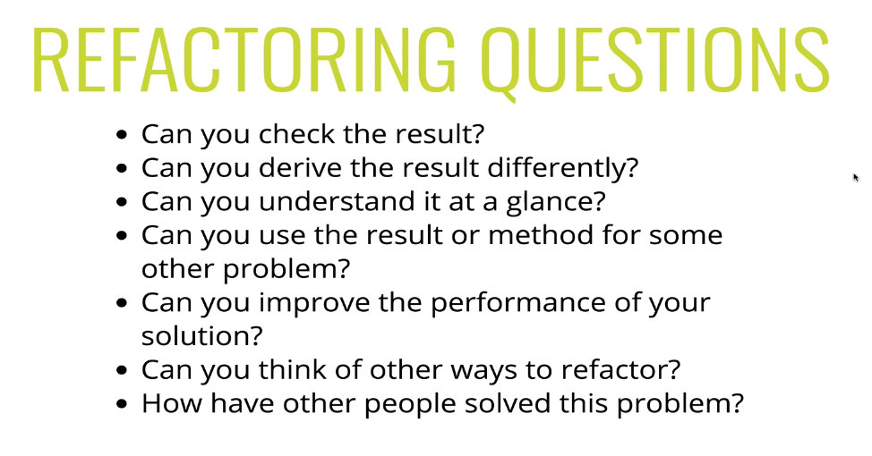

# Look Back and Refactor

- This is a critical point
- its not always the best to just make something work
- How can you improve? talk about the parts you don't like?
- efficiency and legibly often go back and forth.
- checklist:
  
- there is rarely only one solution, can you think about different solutions?
- can you use this problem or the pattern to help you solve a different problem?

```js
function charCount(str) {
  let result = {};
  for (let i = 0; i < str.length; i++) {
    let char = str[i].toLowerCase();
    if (/[a-z0-9]/.test(char)) {
      if (result[char] > 0) {
        result[char]++;
      } else {
        result[char] = 1;
      }
    }
  }
  return result;
}
```

- could use a different loop, for...of?
- could remove if else?
- regExp can be not performant, sometimes they differ in browser
- maybe a better way to do it?
- character codes can replace regExp
- turns out they are much faster!
- when to check for lowercase?

```js
function isAplhaNumeric(char) {
  let code = char.charCodeAt(0);
  if (
    !(code > 47 && code < 58) &&
    !(code > 64 && code < 91) &&
    !(code > 96 && code < 123)
  ) {
    return false;
  }
  return true;
}

function charCount(str) {
  let result = {};
  for (let char of str) {
    if (isAplhaNumeric(char)) {
      char = char.toLowerCase();
      result[char] = ++result[char] || 1;
    }
  }
  return result;
}
```
